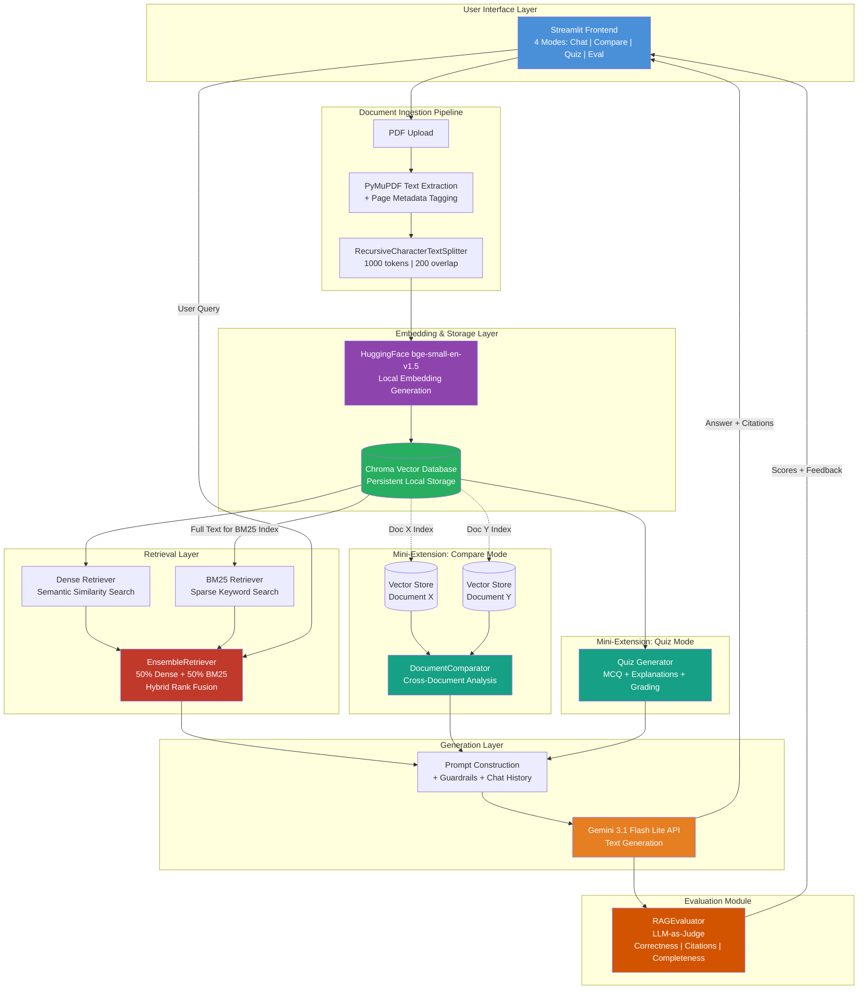

# 📚 AskMyBook: AI-Powered Document Q&A System

> *An intelligent, context-aware document assistant that uses Retrieval-Augmented Generation (RAG) to deliver precise, citation-backed answers from isolated PDF corpora.*

**Author:** Vaishnavi  
**Segment:** Foundations of Applied Machine Learning  
**Problem Statement Code:** I2 (Document Q&A — RAG over a Focused Corpus)

---

## 🎥 Demo
| Description | Link |
| :--- | :--- |
| **Live Deployment:** | [Streamlit app](https://internship-1-fvhaqdvziykwpnsat2m92u.streamlit.app/)|
| **Walkthrough Video (3-5 min):** | [Video Link](https://)|

---

## 🎯 Problem Statement

Manually searching through massive academic textbooks, research papers, or regulatory manuals is highly inefficient. Traditional keyword indexing misses semantic context and intent, while generic Large Language Models (LLMs) frequently hallucinate information when answering domain-specific questions.

**AskMyBook** solves this by bridging the gap between static documents and generative AI. It converts long-form PDFs into a highly structured local vector index. When a user asks a question, the system uses a dual-layer hybrid search mechanism to retrieve the most relevant text chunks and forces the LLM to answer *only* using that retrieved context, strictly enforcing inline page citations. The application supports four distinct modes: single-document Q&A chat, multi-document comparison, auto-generated practice quizzes, and LLM-as-Judge evaluation of responses.

---

## 🏗️ Architecture Diagram




---

```text
PDF Upload
  → PyMuPDF text extraction + page metadata
  → RecursiveCharacterTextSplitter chunking
  → Local HuggingFace BGE embeddings
  → Chroma vector store
  → Hybrid retrieval: BM25 + Dense
  → Prompt construction with guardrails
  → Gemini generation
  → Citation-backed answer
```

---

## 🛠️ Technology Stack

| Component | Choice | Why |
|---|---|---|
| Language | Python 3.10+ | Standard ecosystem for ML, NLP, and data applications. |
| Frontend | Streamlit | Fast prototyping, session-state support, easy deployment. |
| PDF Extraction | PyMuPDF / `fitz` | Fast text extraction with page-level metadata. |
| Chunking | LangChain `RecursiveCharacterTextSplitter` | Preserves semantic structure better than fixed-character splitting. |
| Embeddings | `BAAI/bge-small-en-v1.5` via HuggingFace | Local, free, lightweight, and good quality for retrieval. |
| Vector Database | Chroma | Simple local persistent vector store with metadata support. |
| Retrieval | BM25 + Dense Ensemble | Combines keyword matching and semantic search. |
| LLM | Gemini 3.1 Flash Lite | Low latency, strong instruction-following, useful free tier. |
| Testing | pytest + unittest.mock | Simple Python unit testing with mocked external dependencies. |
| Deployment | Streamlit Community Cloud | Free hosted demo for a Streamlit app. |

---

## 🏁 Quickstart

### Prerequisites

- Python 3.10 or higher
- Git
- A Google Gemini API key from [Google AI Studio](https://aistudio.google.com/apikey)

### 1. Clone the repository

```bash
git clone https://github.com/vaishnaviomkaram/Internship-1.git
cd Internship-1
```

### 2. Create and activate a virtual environment

Optional but recommended:

```bash
python -m venv .venv
source .venv/bin/activate
```

On Windows:

```bash
.venv\Scripts\activate
```

### 3. Install dependencies

```bash
pip install -r requirements.txt
```

### 4. Configure environment variables

Create a `.env` file in the project root:

```bash
GOOGLE_API_KEY="your_api_key_here"
```

For Streamlit Cloud deployment, add `GOOGLE_API_KEY` in the app Secrets panel.

### 5. Add a sample PDF

Add any text-based PDF to:

```text
data/sample_textbook.pdf
```

A sample PDF is not committed due to size and licensing constraints. Use a small public-domain textbook, research paper, college handbook, or course notes.

### 6. Run the application

```bash
streamlit run app.py
```

The app should open at:

```text
http://localhost:8501
```

### 7. Run tests

```bash
python -m pytest tests/ -v
```

Expected result: tests for ingestion and chunking should pass.

---

## 📚 Data Sources

The application accepts text-based PDF documents.

Suitable document types:

- Academic textbooks
- Research papers
- College handbooks
- Course notes
- Policy manuals
- Regulatory documents

Current limitations:

- Scanned PDFs are not supported unless OCR has already been applied.
- Image-heavy PDFs may produce poor text extraction.
- Complex tables and mathematical notation may lose formatting.

For testing, place a PDF at:

```text
data/sample_textbook.pdf
```

---

## 📄 Architecture Decision Records

Major decisions are documented in [`docs/adr/`](docs/adr/).

| ADR | Title | Summary |
|---|---|---|
| [ADR-001](docs/adr/ADR-001.md) | External Gemini API for generation with local embeddings | Local embeddings avoid API cost and rate limits; Gemini provides strong generation quality. |
| [ADR-002](docs/adr/ADR-002.md) | Hybrid retrieval: BM25 + dense embeddings | Combines exact keyword matching with semantic search using 50/50 ensemble weights. |
| [ADR-003](docs/adr/ADR-003.md) | Isolated Streamlit session-state workspaces | Prevents cross-mode leakage between Chat, Compare, Quiz, and Eval modes. |
| [ADR-004](docs/adr/ADR-004.md) | LLM-as-Judge evaluation | Uses a guarded evaluation prompt to score correctness, citation precision, and completeness. |

---

## 🚀 Mini-Extension: Compare Two Documents

The **Compare** mode allows a user to upload two PDF documents and ask comparative questions such as:

- “What is the difference between these two documents on topic X?”
- “How does Document A explain concept Y differently from Document B?”
- “Which document gives a more detailed explanation of Z?”

Implementation details:

- Each document is indexed into its own isolated vector store.
- Relevant chunks are retrieved independently from both documents.
- A comparator prompt forces the LLM to use only the provided contexts.
- Citations are attributed separately, for example:
  - `"quoted text" (Doc 1, Page 3)`
  - `"quoted text" (Doc 2, Page 7)`

This extension demonstrates multi-document reasoning, isolated workspace management, and stronger prompt guardrails.

---

## 🧪 Evaluation

An evaluation report is available in [`docs/eval_report.md`](docs/eval_report.md).

The evaluation checks:

1. **Correctness:** Is the answer grounded in the retrieved context?
2. **Citation precision:** Are page citations accurate and properly formatted?
3. **Completeness:** Does the answer fully address the question using available context?

The app also includes an **Eval** mode that uses LLM-as-Judge scoring on a 1–5 scale.

---

## 🧠 What I Learned

### Key technical learnings

- RAG quality depends heavily on ingestion quality, especially page metadata preservation.
- Hybrid retrieval is stronger than dense-only retrieval for exact terms and conceptual queries.
- Streamlit’s rerun model requires careful session-state design.
- LLM guardrails must be repeated clearly in every prompt.
- JSON output from LLMs often needs cleanup because models may wrap JSON in markdown backticks.
- Deployment exposes hidden assumptions such as missing environment variables, file paths, and write permissions.

### Key product learnings

- A useful RAG system must say “I don’t know” when evidence is weak.
- Citations make the system more trustworthy.
- Isolated workspaces make multi-mode tools easier to reason about.
- Evaluation is not optional; it is how you know whether guardrails are working.

---

## ⚠️ Known Limitations

| Limitation | Impact | Mitigation / Future Work |
|---|---|---|
| Text-only PDFs | Scanned or image-based PDFs are not supported. | Add OCR support in 3rd-year extension. |
| API dependency | Generation fails if Gemini API is unavailable. | Retrieval still works; add fallback provider later. |
| No persistent chat history | Browser refresh loses chat state. | Add database-backed persistence in future. |
| Vector store append behavior | Re-processing may create duplicate chunks if store is not reset. | Use Reset Workspace or delete vector store directory. |
| Large documents | Very large PDFs may increase processing time and memory usage. | Tune chunking and retrieval parameters. |
| Manual evaluation | Evaluation report currently uses manual/LLM-assisted scoring. | Add automated batch evaluation script later. |

---

## 🔭 What I Would Do in 3rd Year

See:

- [`docs/roadmap_3rd_year.md`](docs/roadmap_3rd_year.md)
- [`docs/roadmap_3rd_year_final.md`](docs/roadmap_3rd_year_final.md)

The 3rd-year extension plan focuses on:

- OCR support for scanned documents
- Multi-format ingestion
- Persistent user sessions
- Automated evaluation datasets
- Agentic query decomposition
- Enterprise-grade multi-source RAG

---

## 📁 Project Structure

```text
.
├── app.py                  # Streamlit application
├── requirements.txt        # Python dependencies
├── data/                   # Place PDF documents here
├── docs/                   # Design docs, ADRs, reflection, roadmap, eval report
│   ├── adr/
│   ├── architecture_diagram.md
│   ├── architecture_diagram.png
│   ├── design_doc.md
│   ├── eval_report.md
│   ├── mock_interview.md
│   ├── postmortem.md
│   ├── reflection.md
│   ├── resume_bullets.md
│   ├── resume_final.md
│   └── roadmap_3rd_year.md
├── src/
│   ├── ingest.py           # PDF parsing and page metadata
│   ├── chunk.py            # Semantic chunking
│   ├── embed.py            # Embeddings and Chroma vector store
│   ├── retrieve.py         # Hybrid BM25 + dense retrieval
│   ├── generate.py         # RAG answer and quiz generation
│   ├── compare.py          # Two-document comparison
│   └── eval.py             # LLM-as-Judge evaluation
└── tests/
    ├── test_ingest.py
    └── test_chunk.py
```

---

## 📜 License

This project is released under the MIT License.
