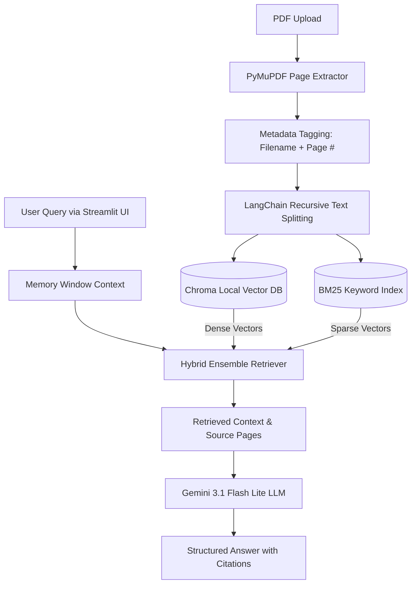

# 📚 AskMyBook: AI-Powered Document Q&A System

> *An intelligent, context-aware document assistant that uses Retrieval-Augmented Generation (RAG) to deliver precise, citation-backed answers from isolated PDF corpora.*

**Author:** Vaishnavi  
**Segment:** Foundations of Applied Machine Learning  
**Problem Statement Code:** I2 (Document Q&A — RAG over a Focused Corpus)[cite: 3]

---

## 🎯 Problem Statement

Manually searching through massive academic textbooks, research papers, or regulatory manuals is highly inefficient. Traditional keyword indexing misses semantic context and intent, while generic Large Language Models (LLMs) frequently hallucinate information when answering domain-specific questions.

**AskMyBook** solves this by bridging the gap between static documents and generative AI. It converts long-form PDFs into a highly structured local vector index. When a user asks a question, the system uses a dual-layer hybrid search mechanism to retrieve the most relevant text chunks and forces the LLM to answer *only* using that retrieved context, strictly enforcing inline page citations.

---

## 🧠 What I Learned

### Week 2: UI, State Management, and API Trade-offs

* **Reactive UIs and Session State:** Building the frontend taught me that Streamlit reruns the script from top to bottom on every user interaction. I learned to use `st.session_state` to persist variables like the `messages` array, `memory_window`, and `db_ready` flags. This ensures users can chat concurrently and adjust settings without losing their previous conversation context or vector database connections.
* **Conversational Context in RAG:** I learned that single-turn RAG is insufficient for a seamless "buddy" experience. I updated the `PromptTemplate` to include a `{chat_history}` variable. By dynamically slicing the `st.session_state.messages` array based on a user-defined memory window and passing it as a formatted string, the LLM can accurately understand follow-up questions.
* **Enforcing JSON Outputs for UI Components:** For the quiz generation mini-extension, I learned how to instruct the LLM to act as a strict teacher and return *only* a valid JSON array of questions, options, and explanations. Because LLMs stubbornly wrap JSON in markdown blocks, I implemented `.replace('```json', '')` as a fallback cleanup mechanism. The Streamlit UI then parses this JSON to render radio buttons and grade the user locally, saving additional API tokens.
* **Architectural Trade-offs (Local vs. Cloud):** I learned the realities of resource constraints during rapid prototyping. I split the processing load into a hybrid model:

| Task | Component Used | Execution Location | Why I Learned This Trade-off |
| --- | --- | --- | --- |
| **Embeddings** | `HuggingFace (BAAI/bge-small-en-v1.5)` | Local | Saves API costs and executes quickly on local hardware for vector math. |
| **Vector Store** | `Chroma` | Local Disk | Learnt how persistent directories allow skipping the parsing phase on subsequent runs. |
| **Text Generation** | `ChatGoogleGenerativeAI (gemini-3.1-flash-lite)` | Cloud API | Prevents local VRAM crashes and executes JSON instructions flawlessly, though it requires managing API rate limits. |

### Week 1: Data Ingestion & Retrieval Strategy

* **Citation Integrity Requires Early Mapping:** I learned that tracking inline citations downstream depends entirely on preserving document structures immediately during ingestion. By injecting 1-indexed page markers directly into the raw dictionary layers using `fitz` (PyMuPDF), I ensured that when the text is split later, every single child chunk inherits its exact parent page number[cite: 1].
* **Semantic Boundaries > Arbitrary Cutoffs:** I initially thought chunking just meant splitting text every 1,000 characters. By implementing LangChain's `RecursiveCharacterTextSplitter`, I learned how to cascade through structural delimiters (`\n\n`, then `\n`, then spaces) to minimize semantic fracture[cite: 1].
* **The Pitfalls of "Dirty" Document Layouts:** Real-world PDFs are messy. They contain blank pages, weird structural layouts, and invisible whitespace characters. I learned that introducing strict `.strip()` validation and skipping empty pages during the extraction phase prevents empty or useless chunks from bloating the vector index[cite: 1].
* **Modularization and Local Persistence:** Moving from a single massive script to a modular architecture (`document_processor.py`, `vector_store.py`, `rag_pipeline.py`) made testing infinitely easier[cite: 1]. Furthermore, pivoting to **Chroma** taught me how local vector persistence works (`persist_directory="./vectorstore"`)[cite: 1].
* **The Necessity of Hybrid Retrieval:** I realized that pure vector similarity (Dense search via BGE-Small) is great for conceptual questions but terrible at finding specific variable names or exact terminology. Wiring up the LangChain `EnsembleRetriever` taught me how to marry dense semantic search with sparse lexical search (`BM25Retriever`) utilizing balanced 0.5/0.5 weights to get the best of both worlds[cite: 1].

---

## 🏗️ Architecture Diagram



---

## 🛠️ Technology Stack

| Component | Choice | Why |
| --- | --- | --- |
| **Language** | Python 3.10+ | Ecosystem standard for data pipelines and machine learning. |
| **PDF Extraction** | PyMuPDF (`fitz`)| High-speed, granular extraction perfect for attaching 1-indexed page numbers. |
| **Chunking** | LangChain Text Splitters | `RecursiveCharacterTextSplitter` preserves semantic blocks and paragraph structures.|
| **Embeddings** | HuggingFace (`BAAI/bge-small-en-v1.5`)| Lightweight, highly accurate local open-source embeddings. |
| **Vector DB** | Chroma | Developer-friendly local persistence engine optimized for metadata filtering. |
| **Retriever** | `EnsembleRetriever`<br> | Combines 50% dense vector search (semantic) with 50% BM25 (sparse keyword). |
| **LLM Engine** | Gemini 3.1 Flash Lite | Ultra-low latency, and exceptional at following strict guardrails. |
| **Frontend UI** | Streamlit | Rapid prototyping for data applications. |


---
## 🏁 Quickstart
### Prerequisites
* Python 3.10 or higher
* Git
### 1. Install
Clone the repository and install the required dependencies:
```bash
git clone https://github.com/vaishnaviomkaram/Internship-1
pip install -r requirements.txt

```
### 2. Environment Variables
The application requires a Gemini API key to run the text generation model.
```bash
echo 'GOOGLE_API_KEY="your_api_key_here"' >> .env

```
### 3. Run the Application
```bash
streamlit run app.py

```
---

## ⚠️ Known Limitations
* Currently optimized for text-heavy PDFs; complex tables or image-based scans (requiring OCR) may lose formatting fidelity during extraction.
* The external Gemini API is subject to daily free-tier rate limits which may temporarily pause text generation during heavy use.
* Re-processing new documents appends data to the existing vector store; clearing the `vectorstore/` directory is required for isolated restarts.


---

## 📄 License & Acknowledgements

Built as part of the **2nd Year B.Tech CSE-AIDE Internship Program (2026)**.

