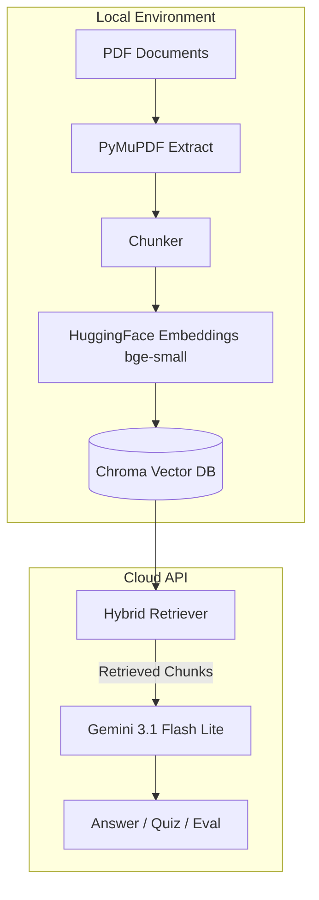

# ADR‑001: Offloading Text Generation to Google Gemini API While Keeping Embeddings Local

**Status:** Accepted  
**Date:** 2026‑07‑10  
**Deciders:** Vaishnavi (sole developer)  

---

## Context

The application must generate natural‑language answers, quiz questions, and comparative analyses based on retrieved document chunks. This requires a Large Language Model (LLM) capable of following strict formatting instructions (e.g., returning clean JSON arrays, refusing to hallucinate). Two broad options exist:

1. Run an LLM entirely locally (e.g., Ollama with Llama‑3, Gemma, or Hugging Face pipelines).  
2. Call a cloud‑hosted LLM API (e.g., Google Gemini, OpenAI).

The embedding step, however, is called much more frequently (once per chunk, plus every query), making it cost‑sensitive. We need a strategy that balances cost, latency, deployment constraints, and capability.

---

## Decision

**We will use the Google Gemini 3.1 Flash Lite API for all text generation tasks, while keeping embedding generation entirely local using the `BAAI/bge‑small‑en‑v1.5` model via Hugging Face.**

- **Embeddings:** Processed locally with `sentence-transformers` / HuggingFace Embeddings. No API calls, no token costs, no rate limits for indexing or retrieval.  
- **Text Generation:** The `ChatGoogleGenerativeAI` client (`langchain-google-genai`) calls `gemini-3.1-flash-lite` for:
  - Answer generation in Q&A and compare modes  
  - Quiz question generation (structured JSON)  
  - LLM‑as‑a‑Judge evaluation  

The model ID is hardcoded in `src/generate.py` as:

```python
ChatGoogleGenerativeAI(model="gemini-3.1-flash-lite", temperature=0)
```

*Note:* During Week 2 we briefly experimented with Google’s Embedding API to offload embeddings, but abandoned it after hitting daily rate limits on the free tier after only a few test runs. The local embedding model has no such limits and fits comfortably on our target deployment hardware (Streamlit Cloud with 16 GB RAM).

---

## Consequences

| Aspect | Positive | Negative / Risk |
|--------|----------|-----------------|
| **Cost** | Local embeddings are free; Gemini’s free tier allows generous daily quota for generation. | Heavy testing could still exhaust the free quota; beyond that, costs would accrue. |
| **Latency** | Gemini Flash Lite responds in ~1‑2 s for typical RAG prompts. Local embedding inference is fast (<100 ms per chunk on CPU). | Network latency and occasional API slowness may degrade user experience. |
| **Reliability** | No dependency on local GPU; the app runs in a standard Python environment. | If Gemini API is down or the key is revoked, the app cannot generate answers (though retrieval still works). |
| **Capability** | Gemini follows strict JSON formatting and guardrail instructions much better than smaller local models (verified with quiz generation). | Relying on an external provider means we cannot fine‑tune the model for domain‑specific style. |
| **Maintenance** | No need to update or manage local LLM weights; just use the latest API version. | API changes (deprecation, pricing) may require code updates. |

---

## Alternatives Considered

| Alternative | Reason for Rejection |
|-------------|----------------------|
| **Local LLM via Ollama (Llama‑3, Gemma)** | Rejected because running a 7‑8B model on free cloud deployment platforms (e.g., Hugging Face Spaces) causes out‑of‑memory errors or unacceptable latency (>30 s per response). The models also often fail to produce strictly formatted JSON arrays for the quiz feature. |
| **OpenAI API (GPT‑4o‑mini)** | Rejected due to cost and less generous free tier compared to Gemini. The project’s “skinny MVP” constraint did not justify a paid API while alternatives exist. |
| **Fully local embeddings + local LLM** | Rejected for the same resource constraints as above. The combination of BGE embeddings and Gemini API hits the sweet spot: free, responsive, and deployable. |
| **Fully cloud (Google Vertex AI Embeddings + Gemini)** | Abandoned after experimenting in Week 2 because the embedding API quota was insufficient for processing even a single textbook. Local embeddings solved this permanently. |

---

## Decision‑Specific Diagram



*Figure: The split between local (embedding + storage + retrieval) and cloud (generation). Only the final prompt with retrieved context is sent to the API, minimizing token usage.*
