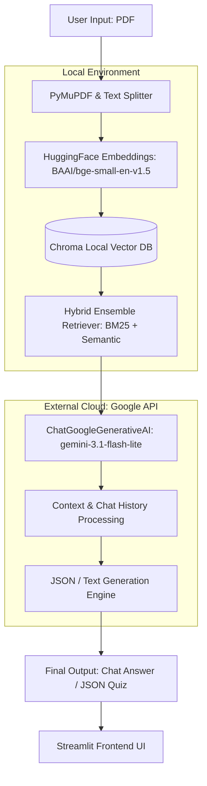

# ADR-001: Offloading LLM Generation to External APIs vs. Local Models

## 1. Context

Our application requires a robust Large Language Model (LLM) to synthesize answers based on retrieved document chunks (RAG) and generate strictly formatted JSON quizzes. Initially, the architectural plan aimed to use external APIs for the entire pipeline to minimize local overhead. However, early testing using Google's text-embedding-004 (Embedding 2) API resulted in rapid quota exhaustion after only a few initial requests, making cloud-based embeddings highly unreliable for heavy document chunking. 

To build a sustainable architecture under strict resource constraints, we had to evaluate where to run local assets versus cloud endpoints. Local LLMs require significant disk space, high VRAM, and heavy computational resources which slow down the rapid prototyping phase and strain local development hardware. 

**Resource Constraints Analysis:**

| Resource Requirement | Local LLM (e.g., 7B-8B parameters) | External API (Gemini Flash Lite) | Impact on MVP Development |
| --- | --- | --- | --- |
| **Disk Space** | ~4GB to 15GB+ per model | **0 MB** (Cloud Hosted) | Local storage fills up quickly during iteration. |
| **VRAM / RAM** | 8GB - 16GB minimum | **Minimal** (Standard HTTP requests) | Local hardware stutters; background processes crash. |
| **Processing Speed** | Slow (Tokens generated locally) | **Ultra-fast** (Cloud inference) | UI feels sluggish locally, breaking the UX. |
| **JSON Adherence** | Inconsistent on smaller models | **Highly reliable** | Breaking JSON formats crashes the quiz generator. |

---

## 2. Decision

We chose to implement a **Hybrid Inference Architecture**:

1. **Local Ingestion & Embeddings:** We keep the document ingestion, parsing, and vector embeddings local. We utilize `BAAI/bge-small-en-v1.5` for embedding generation and persist the vector data locally using `Chroma`. This completely bypasses the cloud API quota exhaustion issue discovered during the prototyping phase.
2. **External Cloud Generation:** We offload the heavy text synthesis, conversational tracking, and structural quiz generation to Google's Cloud API (`gemini-3.1-flash-lite`) via `langchain-google-genai`.

---

## 3. Consequences

### Positive Impacts (The "Why")

* **Infinite Local Ingestion:** By running embeddings locally via BGE-Small, we can parse large textbooks without triggering any API rate limits or credit exhaustion errors.

* **Rapid UI Responsiveness:** Offloading the text synthesis text execution to the cloud keeps the local Streamlit application fast and responsive.

* **Massive Storage & Compute Savings:** Bypassing local 10GB+ LLM downloads preserves local disk space and prevents application hardware crashes.
* **Strict Format Adherence:** The Gemini engine strictly follows prompt rules (e.g., returning clean JSON arrays for the mini-extension) much better than smaller local, open-weights models.

### Negative Trade-offs (The Risks)

* **Internet Dependency:** The RAG pipeline will instantly fail if the host machine loses network connection or if the external API experiences downtime.
* **Strict Credit Quotas on Generation:** We are heavily constrained by the daily free-tier credit quota provided by the generation API. High-volume testing and debugging chat sessions might be throttled, causing `429 Too Many Requests` errors.
* **Data Privacy Boundaries:** Uploaded document context is sent to external servers, meaning highly sensitive or classified PDFs cannot be handled under this architecture without auditing Google's data retention policies.

---

## 4. Alternatives Considered

| Alternative Solution | Description | Reason for Rejection |
| --- | --- | --- |
| **Fully Cloud API Pipeline** | Running both embeddings (Embedding 2) and generation via external cloud endpoints. | **Rejected:** Cloud embedding API endpoints hit immediate limit exhaustion after a few initial setup requests, blocking document ingestion pipelines.|
| **Fully Local LLMs (Ollama / Llama.cpp)** | Running models like Llama 3 (8B) or Gemma (2B) locally on the machine. | **Rejected:** Running them locally causes heavy system latency on standard laptops. Deploying them requires expensive cloud GPUs, which defeats the "skinny MVP" constraint. |
| **Local Small Language Models (SLMs)** | Running ultra-tiny models (< 1B parameters) locally for text generation. | **Rejected:** SLMs struggled heavily with the strict JSON formatting required by the Quiz Generation module, returning markdown wrappers or malformed arrays that broke the UI logic.|

### Architecture Flow Diagram

