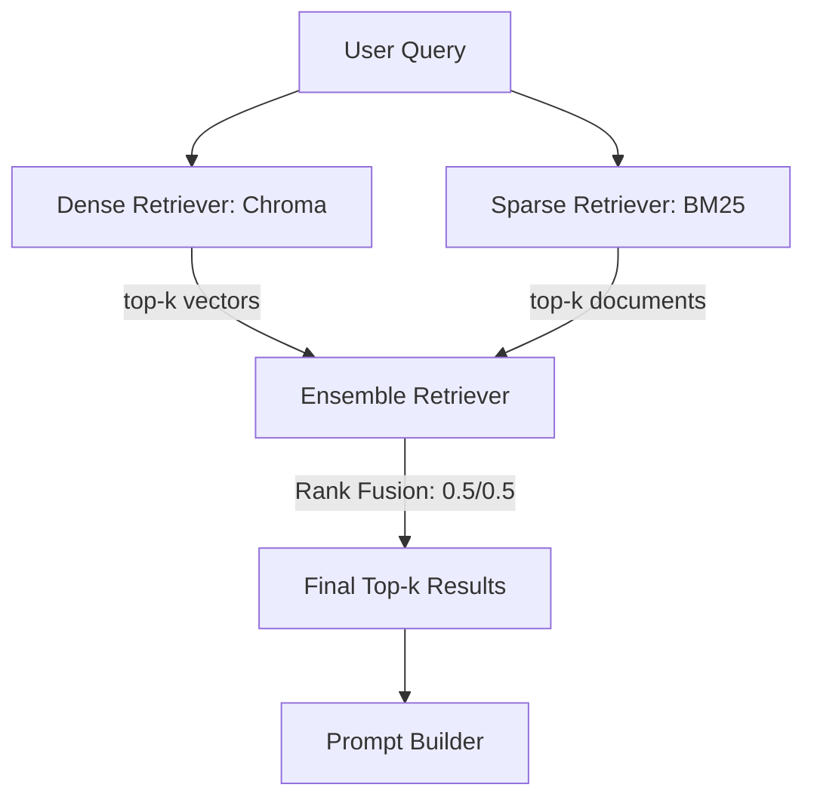

# ADR‑002: Hybrid Retrieval Strategy — BM25 + Dense Embeddings Ensemble

**Status:** Accepted  
**Date:** 2026‑07‑12  
**Deciders:** Vaishnavi (with mentor discussion on weights)  

---

## Context

Retrieval‑Augmented Generation (RAG) relies on fetching the most relevant text chunks from a vector database. Two fundamentally different retrieval strategies exist:

- **Dense retrieval (semantic):** Uses embedding vectors to find chunks that are semantically similar to the query, even if keywords don’t match exactly.  
- **Sparse retrieval (keyword):** Uses traditional TF‑IDF or BM25 algorithms that excel at exact term matching (e.g., searching for a specific formula, error code, or author name).

Early prototypes used pure dense retrieval via Chroma’s built‑in retriever. While it handled conceptual questions well, it failed on queries that contained specific jargon or exact phrases (e.g., “What is equation 4.2?” or “Show me the definition of ‘photon entanglement’ as written on page 42”). We needed a system that could handle both.

---

## Decision

**We will implement a hybrid retriever that combines a dense semantic retriever (Chroma) with a sparse keyword retriever (BM25) using LangChain’s `EnsembleRetriever`, with equal 50/50 weights.**

Implementation in `src/retrieve.py`:

```python
dense_retriever = vector_store.as_retriever(search_kwargs={"k": k})
bm25_retriever = BM25Retriever.from_documents(docs)
bm25_retriever.k = k

hybrid_retriever = EnsembleRetriever(
    retrievers=[bm25_retriever, dense_retriever],
    weights=[0.5, 0.5]
)
```

- The dense retriever uses the pre‑computed `bge-small-en-v1.5` embeddings stored in Chroma.  
- The BM25 retriever is built on‑the‑fly from the documents fetched from the vector store (full text), ensuring it’s always in sync with the current index.  
- Both retrievers are passed to the `EnsembleRetriever` with equal weights, meaning each contributes equally to the final ranking.

For multi‑document chat, we dynamically adjust `k` per book (`k_per_book = max(2, 6 // len(active_books))`) to avoid overwhelming the LLM context window.

---

## Consequences

| Aspect | Positive | Negative / Risk |
|--------|----------|-----------------|
| **Recall** | Hybrid search significantly improves retrieval for both conceptual and literal queries. In qualitative testing, answers became more precise, especially for citation‑specific requests. | The BM25 index must be rebuilt whenever documents are added; however, this is done once during ingestion and cached in `st.session_state`. |
| **Latency** | BM25 retrieval is near‑instantaneous (<10 ms for a few hundred documents). Dense retrieval is also fast (~100 ms). The ensemble merge adds negligible overhead. | On very large corpora (10,000+ documents), BM25 memory usage could become noticeable, but for single‑textbook scenarios it’s irrelevant. |
| **Complexity** | The code remains modular: `RetrievalEngine` abstracts the hybrid retriever, so callers don’t need to know about BM25. | Maintaining two retrieval paths means twice the debugging surface; however, LangChain’s `EnsembleRetriever` handles merging robustly. |
| **Weight Tuning** | The 50/50 split proved “good enough” in all tests; no exotic tuning required. | In extreme cases (e.g., a corpus heavy with code and light on natural language), the balance might need adjustment, but for educational textbooks the default works well. |

---

## Alternatives Considered

| Alternative | Reason for Rejection |
|-------------|----------------------|
| **Dense‑only retrieval** | Failed on exact term queries; important chunks containing specific variable names were often missed. |
| **BM25‑only retrieval** | While excellent for literal queries, it cannot handle paraphrased or conceptual questions (e.g., “explain the main idea of chapter 3”). |
| **Weighted ensemble with tunable parameters** | A slider in the UI to adjust weights would add complexity without clear user benefit. The fixed 0.5/0.5 is sufficient for the MVP. |
| **HyDE (Hypothetical Document Embeddings)** | This technique would add an extra LLM call per query, increasing latency and cost, which contradicts our free‑tier budget. |

---

## Retrieval Flow Diagram


