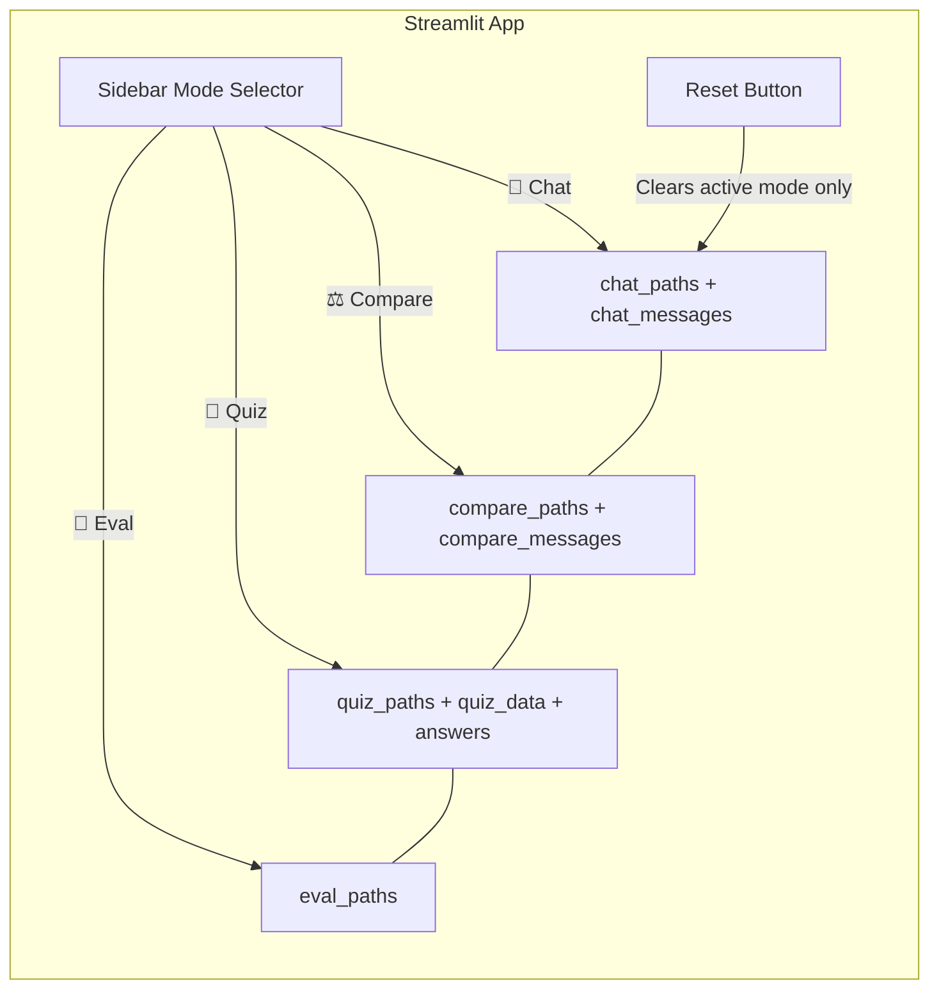

# ADR‑003: Session‑State Isolation for Multi‑Mode Streamlit Application

**Status:** Accepted  
**Date:** 2026‑07‑17  
**Deciders:** Vaishnavi (discovered necessity during debugging of chat history leaks)  

---

## Context

Our Streamlit application supports four distinct modes: **Chat**, **Compare**, **Quiz**, and **Eval**. Each mode uploads its own PDF(s), creates its own vector store(s), maintains its own chat history, and (in the case of Quiz) holds quiz answers and submission state. Streamlit’s reactive execution model re‑runs the entire script on every user interaction, so all persistent data must be stored in `st.session_state`.

During Week 2, I noticed a critical bug: switching from Chat mode to Compare mode and back could cause cross‑mode contamination—the chat history from one mode appearing in another, or vector store paths mixing. This happened because I was using a single global `st.session_state` key (e.g., `st.session_state.messages`) for all modes.

---

## Decision

**We will use mode‑specific session‑state dictionaries to completely isolate data between workspaces.** Each mode gets its own “namespace” for:

- Vector store paths: `st.session_state["chat_paths"]`, `"compare_paths"`, `"quiz_paths"`, `"eval_paths"`  
- Chat / comparison messages: `st.session_state["chat_messages"]`, `"compare_messages"`  
- Quiz data, submission flag, user answers  

The relevant initialisation in `app.py`:

```python
modes = ["chat", "compare", "quiz", "eval"]
for mode in modes:
    if f"{mode}_paths" not in st.session_state:
        st.session_state[f"{mode}_paths"] = {}

if "chat_messages" not in st.session_state: st.session_state.chat_messages = []
if "compare_messages" not in st.session_state: st.session_state.compare_messages = []
# ... and so on
```

The sidebar “Reset Workspace” button only clears the active mode’s paths and messages, leaving other workspaces intact:

```python
st.session_state[f"{clean_mode}_paths"] = {}
if clean_mode == "chat": st.session_state.chat_messages = []
if clean_mode == "compare": st.session_state.compare_messages = []
if clean_mode == "quiz": 
    st.session_state.quiz_data = None
    st.session_state.quiz_submitted = False
```

The radio button selection (`mode`) is mapped to a “clean mode” string (`"chat"`, `"compare"`, etc.) to dynamically access the correct dictionary.

---

## Consequences

| Aspect | Positive | Negative / Risk |
|--------|----------|-----------------|
| **Data integrity** | Users can switch between modes without losing data. No cross‑mode leakage of chat histories or quiz states. | The code is slightly more verbose (multiple `if` blocks to reset the correct state). |
| **Memory usage** | Each mode’s vector store paths are retained, but only the necessary metadata is stored (paths, not the actual vectors). | If a user uploads a very large PDF to every mode, the combined session state might become large, but Streamlit Cloud’s 16 GB limit is more than sufficient. |
| **User experience** | Intuitive: each workspace feels independent. Resetting Compare doesn’t wipe Chat. | The user must understand that documents processed in one mode are not automatically available in another—this is by design, but it may confuse someone expecting a global library. |
| **Extensibility** | Adding a new mode is simple: just define a new set of state keys. | None significant. |

---

## Alternatives Considered

| Alternative | Reason for Rejection |
|-------------|----------------------|
| **Single global `messages` list, filtered by mode** | Led to bugs when switching modes quickly; messages from old modes lingered. Filtering added complexity and didn’t solve the vector store path mixing. |
| **Streamlit’s `st.query_params` to store mode** | Query parameters are URL‑based and can be shared/bookmarked, but they don’t solve state persistence; reloading the page would lose all data. |
| **Separate pages per mode (Streamlit multipage app)** | Would require multiple Python files and explicit navigation; the sidebar radio approach was simpler and kept the codebase small. Multipage also makes it harder to share data between pages. |
| **Using a database (SQLite) to persist state** | Overkill for a 5‑week internship MVP. The state is ephemeral and need not survive server restarts. Added deployment complexity. |

---

## State Isolation Diagram



*Figure: Each mode has its own isolated bubble of session state. The reset button only empties the currently active bubble, leaving the others untouched.*
