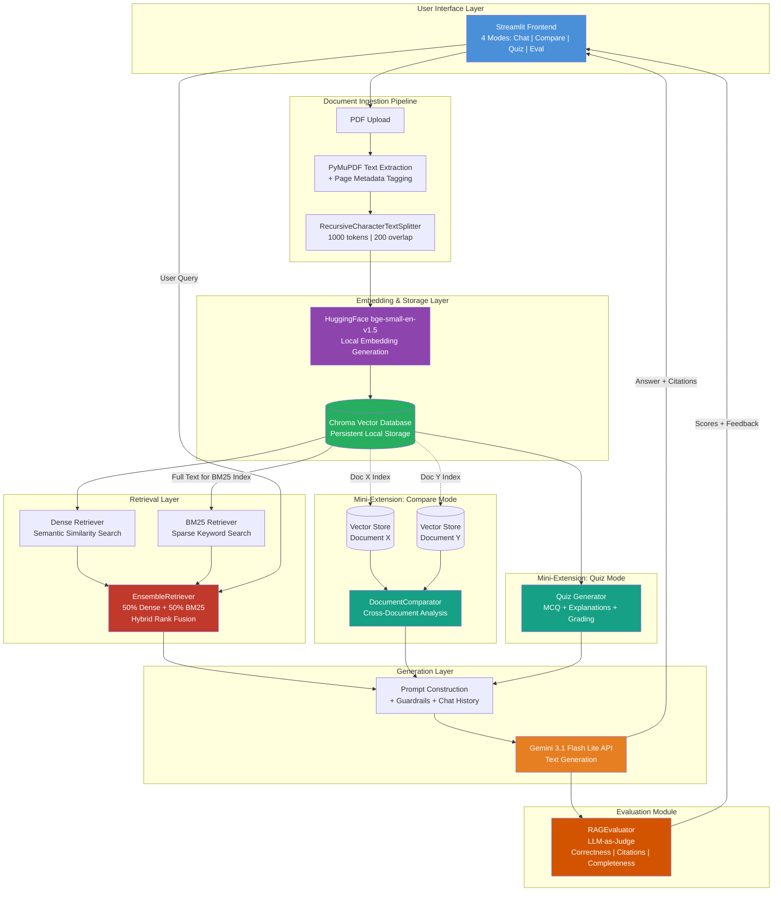

```mermaid
graph TD
    subgraph "User Interface Layer"
        UI["Streamlit Frontend<br/>4 Modes: Chat | Compare | Quiz | Eval"]
    end

    subgraph "Document Ingestion Pipeline"
        UPLOAD["PDF Upload"]
        EXTRACT["PyMuPDF Text Extraction<br/>+ Page Metadata Tagging"]
        CHUNK["RecursiveCharacterTextSplitter<br/>1000 tokens | 200 overlap"]
    end

    subgraph "Embedding & Storage Layer"
        EMBED["HuggingFace bge-small-en-v1.5<br/>Local Embedding Generation"]
        CHROMA[("Chroma Vector Database<br/>Persistent Local Storage")]
    end

    subgraph "Retrieval Layer"
        DENSE["Dense Retriever<br/>Semantic Similarity Search"]
        BM25["BM25 Retriever<br/>Sparse Keyword Search"]
        ENSEMBLE["EnsembleRetriever<br/>50% Dense + 50% BM25<br/>Hybrid Rank Fusion"]
    end

    subgraph "Generation Layer"
        PROMPT["Prompt Construction<br/>+ Guardrails + Chat History"]
        GEMINI["Gemini 3.1 Flash Lite API<br/>Text Generation"]
    end

    subgraph "Mini-Extension: Compare Mode"
        VS1[("Vector Store<br/>Document X")]
        VS2[("Vector Store<br/>Document Y")]
        COMPARE["DocumentComparator<br/>Cross-Document Analysis"]
    end

    subgraph "Mini-Extension: Quiz Mode"
        QUIZ["Quiz Generator<br/>MCQ + Explanations + Grading"]
    end

    subgraph "Evaluation Module"
        EVAL["RAGEvaluator<br/>LLM-as-Judge<br/>Correctness | Citations | Completeness"]
    end

    UI --> UPLOAD
    UPLOAD --> EXTRACT
    EXTRACT --> CHUNK
    CHUNK --> EMBED
    EMBED --> CHROMA
    
    CHROMA --> DENSE
    CHROMA -->|"Full Text for BM25 Index"| BM25
    DENSE --> ENSEMBLE
    BM25 --> ENSEMBLE
    
    UI -->|"User Query"| ENSEMBLE
    ENSEMBLE --> PROMPT
    PROMPT --> GEMINI
    GEMINI -->|"Answer + Citations"| UI
    
    CHROMA -.->|"Doc X Index"| VS1
    CHROMA -.->|"Doc Y Index"| VS2
    VS1 --> COMPARE
    VS2 --> COMPARE
    COMPARE --> PROMPT
    
    CHROMA --> QUIZ
    QUIZ --> PROMPT
    
    GEMINI --> EVAL
    EVAL -->|"Scores + Feedback"| UI

    style UI fill:#4A90D9,color:#fff
    style GEMINI fill:#E67E22,color:#fff
    style CHROMA fill:#27AE60,color:#fff
    style EMBED fill:#8E44AD,color:#fff
    style ENSEMBLE fill:#C0392B,color:#fff
    style COMPARE fill:#16A085,color:#fff
    style QUIZ fill:#16A085,color:#fff
    style EVAL fill:#D35400,color:#fff
```
