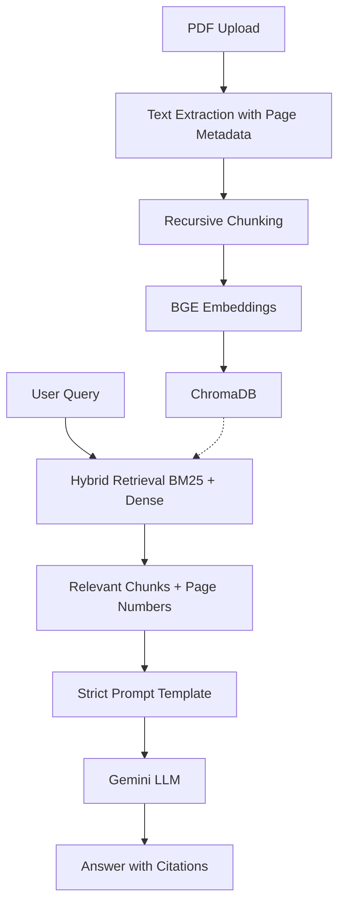

# Design Document

## Project: AI-Powered Document Question Answering System (RAG)

**Author:** Vaishnavi  
**Project Type:** Applied Machine Learning  
**Domain:** Natural Language Processing (NLP) & Large Language Models (LLMs)  
**Problem Code:** I2 (Document Q&A — RAG over a Focused Corpus)

---

# Table of Contents

1. Introduction
2. Problem Statement
3. Objectives
4. System Overview
5. Architecture
6. Technology Stack
7. Functional Requirements
8. Non-Functional Requirements
9. Workflow
10. System Modules
11. Data Flow
12. Folder Structure
13. Testing Strategy
14. Future Improvements
15. Conclusion

---

# 1. Introduction

The **AI-Powered Document Question Answering System** is an intelligent application that enables users to ask questions about uploaded documents using natural language.

Instead of manually searching through lengthy PDFs, the system uses **Retrieval-Augmented Generation (RAG)** to retrieve the most relevant information from uploaded documents and generates accurate responses using a Large Language Model (LLM).

---

# 2. Problem Statement

Searching through academic books, research papers, regulations, reports, and other lengthy documents is often inefficient and time-consuming. Traditional keyword search cannot understand context or semantics, making it difficult to locate precise information.

This project creates an intelligent assistant capable of understanding user queries, retrieving relevant document sections, and generating context-aware answers explicitly backed by inline citations.

---

# 3. Objectives

## Primary Objectives
- Upload and process PDF documents page-by-page.
- Extract and clean document text while preserving page-level metadata.
- Generate semantic embeddings using local open-source models.
- Store embeddings and metadata in a persistent local vector database.
- Retrieve relevant information efficiently using Hybrid Search (BM25 + Dense).
- Generate accurate, citation-backed answers using a strict prompt layer.

## Secondary Objectives
- Modular architecture
- User-friendly interface
- Source attribution and strict LLM guardrails
- Future scalability

---

# 4. System Overview

The system consists of six stages:
1. Document Upload
2. Text Extraction & Metadata Tagging
3. Structural Text Chunking
4. Embedding Generation
5. Hybrid Semantic Retrieval 
6. Prompt Construction & Answer Generation

---

# 5. Architecture

```text
                    User
                      │
                      ▼
             Streamlit Interface
                      │
                      ▼
             PDF Document Upload
                      │
                      ▼
             Text Extraction Layer (PyMuPDF)
                      │
                      ▼
             Text Chunking Module
                      │
                      ▼
             Embedding Generation (BGE-Small)
                      │
                      ▼
             Chroma Vector Database
                      │
         ┌────────────┴────────────┐
         ▼                         ▼
   User Question             Query Embedding
         └────────────┬────────────┘
                      ▼
     Hybrid Search (Chroma Dense + BM25 Sparse)
                      ▼
             Retrieve Relevant Chunks
                      ▼
             Prompt Construction Layer
                      ▼
     Large Language Model (Gemini 1.5 Flash)
                      ▼
                Generated Response
```
## 6. Technology Stack

| Component | Technology |
| :--- | :--- |
| **Language** | Python 3.10+ |
| **Frontend** | Streamlit |
| **Framework** | LangChain |
| **Embeddings** | HuggingFace (`BAAI/bge-small-en-v1.5`) |
| **Vector Database** | ChromaDB |
| **PDF Loader** | PyMuPDF (`fitz`) |
| **LLM Engine** | ChatGoogleGenerativeAI (`gemini-flash-lite-latest`) |
| **Version Control** | Git & GitHub |

---

## 7. Functional Requirements

* **Document Ingestion:** Upload one or more PDF documents.
* **Metadata Extraction:** Extract text while tagging the source filename and 1-indexed page number.
* **Text Chunking:** Split text into overlapping semantic chunks using `RecursiveCharacterTextSplitter`.
* **Vectorization:** Generate 384-dimensional embeddings for chunks.
* **Storage:** Store vectors and metadata locally in Chroma.
* **Search Mechanism:** Perform dual-layer hybrid retrieval (Dense + Sparse/BM25).
* **Grounded Generation:** Generate responses strictly from the provided context.
* **Hallucination Control:** Refuse to answer ("I don't know") if the context lacks the answer.
* **Source Attribution:** Display inline citations (e.g., *"quoted text"* (Page X)).

---

## 8. Non-Functional Requirements

* **Performance:** Fast retrieval times using local embeddings.
* **Data Integrity:** Reliable metadata preservation across processing stages.
* **Maintainability:** Modular codebase separating ingestion, storage, and retrieval layers.
* **Security & Reliability:** Strict protection against LLM hallucinations via rigorous prompt engineering.

---

## 9. Workflow

1.  **Upload:** User uploads PDF documents via the frontend.
2.  **Extract:** System extracts document text and binds page numbers to the metadata.
3.  **Chunk:** Text is split into 1000-token chunks with a 200-token overlap.
4.  **Embed:** Local HuggingFace embeddings are generated for every chunk.
5.  **Persist:** Embeddings and text are stored in a local Chroma directory.
6.  **Query Vectorization:** The system converts the incoming user query into an embedding.
7.  **Hybrid Search:** Most relevant chunks are retrieved using a 50/50 weighted Ensemble Retriever.
8.  **Prompt Synthesis:** A restricted prompt is constructed containing only the retrieved context chunks.
9.  **Generation:** The Gemini LLM generates the final answer complete with inline citations.

---

## 10. System Modules

* `document_processor.py`: Handles PDF loading, text extraction, and chunking.
* `vector_store.py`: Manages embedding generation and Chroma DB persistence.
* `rag_pipeline.py`: Manages the Hybrid Retriever and LangChain LLM execution.
* `app.py`: The Streamlit frontend interface.

---

## 11. Data Flow



```

12. Folder Structure
Plaintext
Document-QA-RAG/
├── app.py
├── README.md
├── requirements.txt
├── docs/
│   └── design_doc.md
├── src/
│   ├── document_processor.py
│   ├── vector_store.py
│   └── rag_pipeline.py
├── data/
│   └── sample_textbook.pdf
└── vectorstore/

```
## 13. Testing Strategy

*   **Unit Testing:** Validating chunk metadata accuracy and empty page handling.
*   **Integration Testing:** Ensuring local embeddings successfully write to and read from the Chroma directory.
*   **Evaluation Matrix:** Testing 20+ Q&A pairs specifically for fact correctness, citation precision, and completeness.
*   **Guardrail Testing:** Injecting out-of-bounds questions to ensure the LLM strictly outputs the required *"I don't know"* response.

---

## 14. Future Improvements

*   [ ] **OCR Support:** Processing for scanned, image-based PDFs.
*   [ ] **Advanced Queries:** Multi-document cross-referencing and comparison.
*   [ ] **State Management:** Conversation memory buffer for contextual follow-up questions.
*   [ ] **Infrastructure:** Cloud deployment and containerization via Docker.

---

## 15. Conclusion

> This project demonstrates a production-grade **Retrieval-Augmented Generation (RAG)** pipeline. By combining semantic dense search, sparse keyword search, local vector databases, and rigorous prompting, it provides highly accurate, context-aware answers anchored entirely by verified inline document citations.
This project demonstrates a production-grade Retrieval-Augmented Generation (RAG) pipeline. By combining semantic dense search, sparse keyword search, local vector databases, and rigorous prompting, it provides highly accurate, context-aware answers anchored entirely by verified inline document citations.
